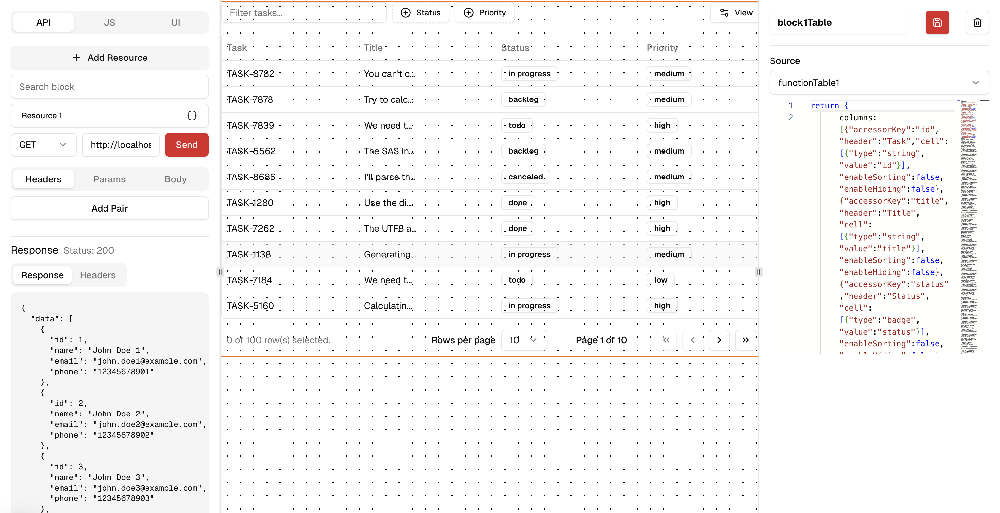

# Rouge

Rouge is a low-code platform that enables you to rapidly build custom internal tools, dashboards, and CRUD applications without extensive coding.

## Features

- **Visual UI Builder**: Drag-and-drop interface components to create responsive UIs
- **REST API**: Connect to REST APIs, databases, and third-party services
- **Custom JavaScript Functions**: Write custom JS logic to handle complex business requirements

# Demo

Rouge is licensed under the [MIT License](LICENSE).